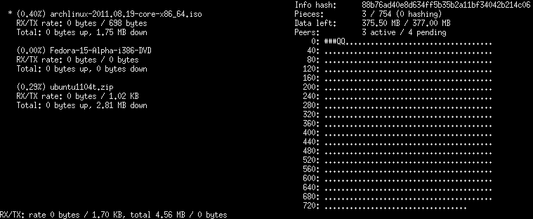
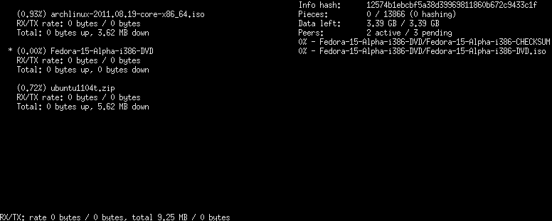
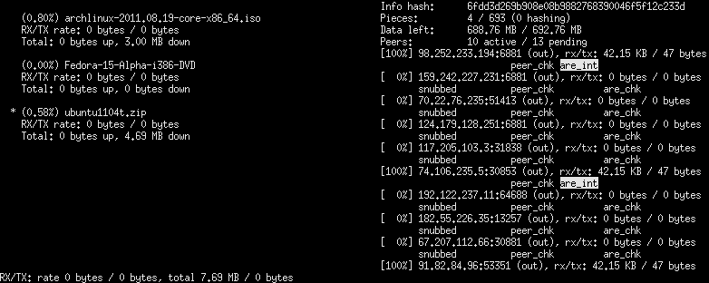

# tortilla
This is my C++ BitTorrent library, which was written in order to gain a understand the <a href="http://www.bittorrent.org/beps/bep_0000.html">BitTorrent protocol</a>. It is designed to use multi-threading to take advantage of current multi-processor and multi-core systems, which are quite prevalent now.

## Status

Tortilla is a stable, high-performing (capable of maxing out gigabit connections) and usable torrent client. The main interface is a ncurses-based client, which is comparable to the _rTorrent_ interface.

Features like encryption and distributed hash tables (DHT) are not implemented.

## Screenshots

Chunk overview

File overview

Peer overview

